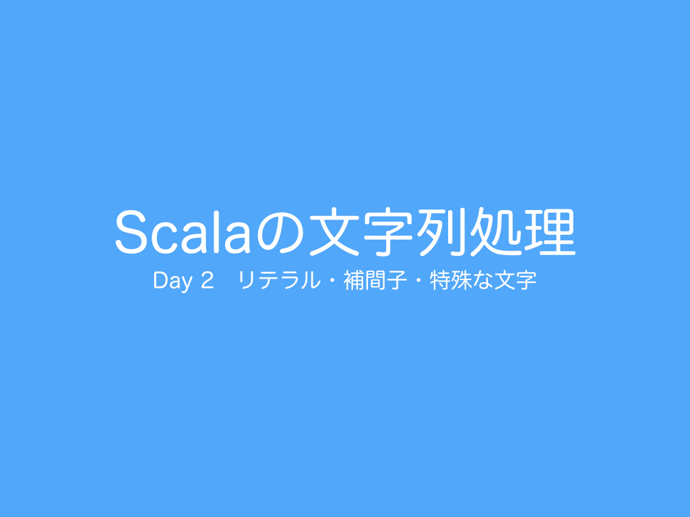

<h1>Day 2 リテラル・補間子・特殊な文字</h1>

今日は、Scalaの文字列処理に関するリテラル・補間子・特殊な文字について紹介します。  

<h2>リポジトリ（サンプルコード）</h2>
<a href="https://github.com/ynupc/scalastringcourseday2" target="_blank">https://github.com/ynupc/scalastringcourseday2</a>  

<h2>クイズ</h2>
<a href="http://ynupc.github.io/quiz/scalastringcourse/day2/" target="_blank">http://ynupc.github.io/quiz/scalastringcourse/day2/</a>  

<h2>目次</h2>
<strong><a href="doc/literal.md#1リテラル">1.　リテラル</a></strong>  
<a href="doc/literal.md#コラム非ヒープ領域によるoutofmemoryerror">コラム：非ヒープ領域によるOutOfMemoryError</a>  
<a href="doc/literal.md#コラムoutofmemoryerrorやstackoverflowerrorの対処法">コラム：OutOfMemoryErrorやStackOverflowErrorの対処法</a>  
<a href="doc/literal.md#１プログラム上で使用するメモリ容量を減らす">（１）プログラム上で使用するメモリ容量を減らす</a>  
<a href="doc/literal.md#２物理的に割り当てる容量を変更する">（２）物理的に割り当てる容量を変更する</a>  
<strong><a href="doc/literal.md#11文字に関するリテラル">1.1　文字に関するリテラル</a></strong>  
<a href="doc/literal.md#コラムなぜ１文字が１つのchar型で表せなくなったのか文字コードの歴史">コラム：なぜ１文字が１つのchar型で表せなくなったのか、文字コードの歴史</a>  
<strong><a href="doc/literal.md#12文字に関するリテラルの例">1.2　文字に関するリテラルの例</a></strong>  
<a href="doc/literal.md#コラムscalaのvalとvarの使い分け">コラム：Scalaのvalとvarの使い分け</a>  
<a href="doc/literal.md#コラム日本語の半角円記号とバックスラッシュ記号の混同問題">コラム：日本語の半角円記号とバックスラッシュ記号の混同問題</a>  
<strong><a href="doc/literal.md#13生文字リテラル">1.3　生文字リテラル</a></strong>  
<a href="doc/literal.md#コラム文字列の一致">コラム：文字列の一致</a>  
<a href="doc/literal.md#コラム文字の一致">コラム：文字の一致</a>  
<strong><a href="doc/literal.md#14生文字リテラルの改行のインデントを揃える方法">1.4　生文字リテラルの改行のインデントを揃える方法</a></strong>  

<strong><a href="doc/stringinterpolation.md#2補間子">2.　補間子</a></strong>  
<strong><a href="doc/stringinterpolation.md#21s補間子">2.1　s補間子</a></strong>  
<strong><a href="doc/stringinterpolation.md#22f補間子">2.2　f補間子</a></strong>  
<strong><a href="doc/stringinterpolation.md#23raw補間子">2.3　raw補間子</a></strong>  
<strong><a href="doc/stringinterpolation.md#24文字列リテラルraw補間子と生文字リテラルの違い">2.4　文字列リテラル＋raw補間子と生文字リテラルの違い</a></strong>  
<strong><a href="doc/stringinterpolation.md#25補間子の自作">2.5　補間子の自作</a></strong>  

<strong><a href="doc/specialcharacters.md#3特殊な文字">3.　特殊な文字</a></strong>  
<strong><a href="doc/specialcharacters.md#31エスケープシーケンス">3.1　エスケープシーケンス</a></strong>  
<strong><a href="doc/specialcharacters.md#32unicodeシーケンス">3.2　Unicodeシーケンス</a></strong>   
<a href="doc/specialcharacters.md#コラム幽霊文字">コラム：幽霊文字</a>  
<a href="doc/specialcharacters.md#コラム波ダッシュと全角チルダの問題">コラム：波ダッシュと全角チルダの問題</a>  
<strong><a href="doc/specialcharacters.md#33os依存文字">3.3　OS依存文字</a></strong>  
