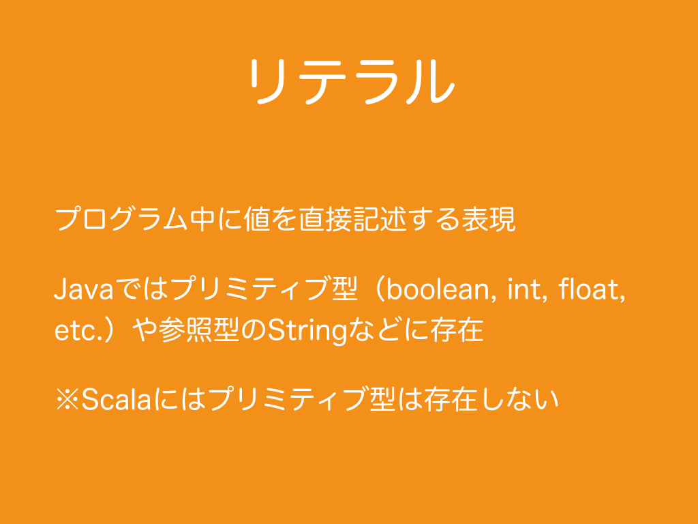
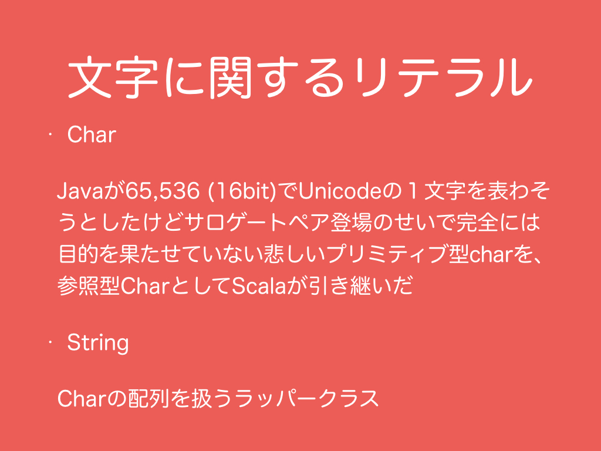
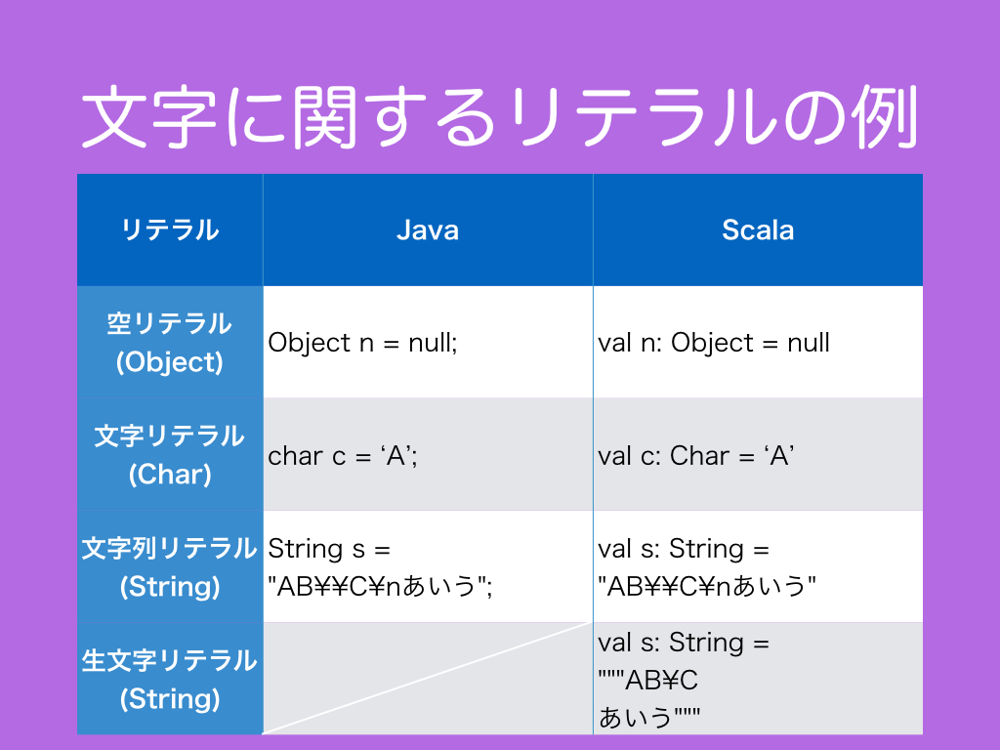
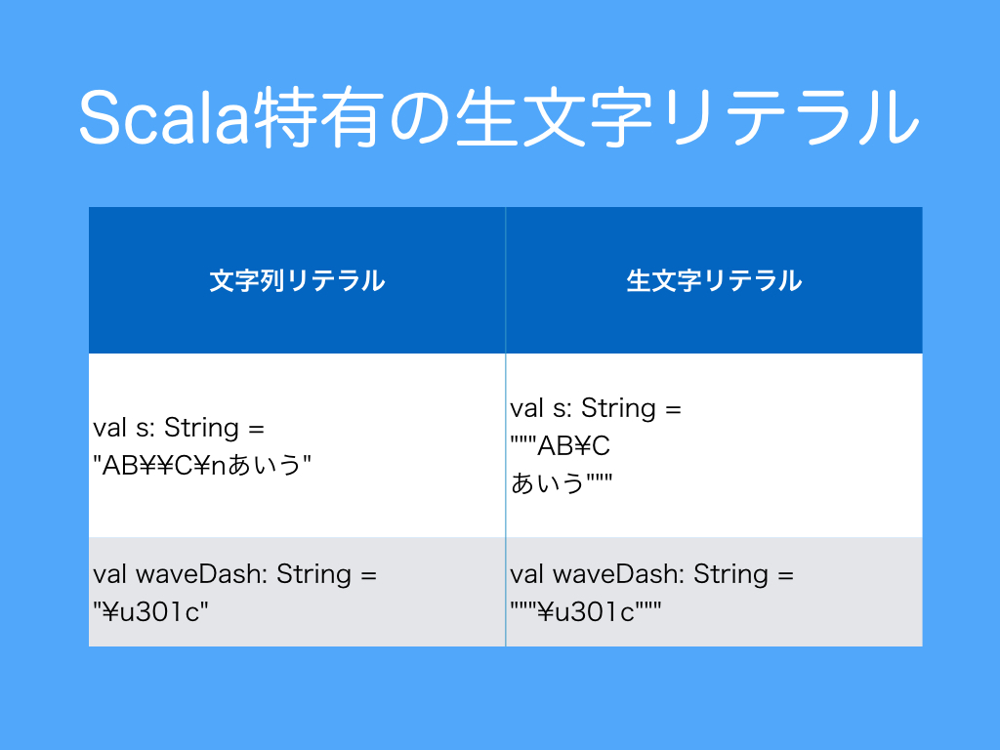
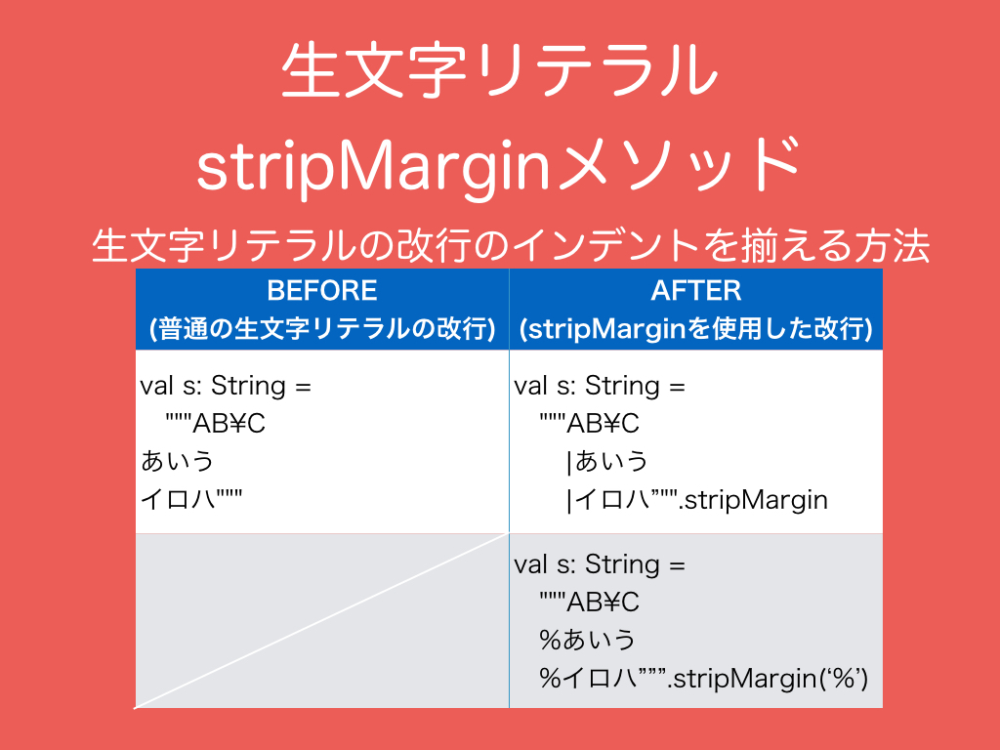
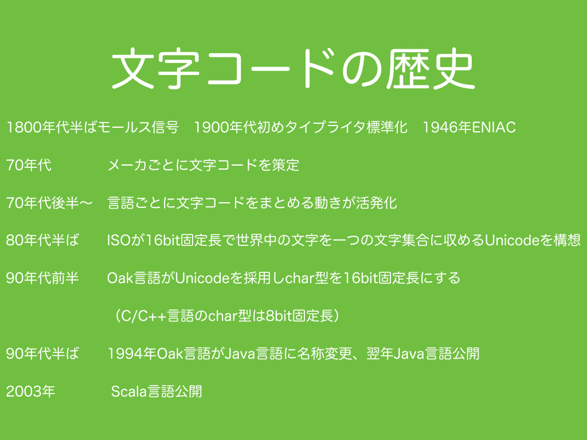

# 1.　リテラル


<br>
リテラルとは、プログラム中に値を直接記述する表現、あるいはその値そのもののことです。Javaでは、プリミティブ型と参照型、値型と参照型という言い方もありますが、int, float, booleanのようなプリミティブ型をプログラム中に記述する際に、`int i = 0;`のように代入する値0をリテラルで書きます。主にプリミティブ型をリテラルで表記しますが、ダブルクォーテーションで囲われた文字列やnullのような特殊な参照型もリテラルが存在します。Scalaは全ての型が参照型でありプリミティブ型は存在しませんが、Javaに存在するリテラルはScalaでも同様に存在します。プリミティブ型はスタック領域に保持され、参照型、は参照はスタック領域に、インスタンスはヒープ領域に保持されます。Stringクラスの<a href="http://docs.oracle.com/javase/jp/8/api/java/lang/String.html#intern--" target="_blank">intern</a>メソッドを使用した場合のインスタンスは、Java 6まではPermanent領域に保持され、Java 7からはヒープ領域に保持されるようになりました。なお、本書ではStringクラスのinternメソッドもそれに類するScalaの<a href="http://www.scala-lang.org/api/current/index.html#scala.Symbol" target="_blank">Symbol</a>クラスやSymbolリテラルについても取り上げません。（一般的に、Symbolやinternは文字列処理というよりはマップのキーの管理の文脈で登場する技術です。）  
<br>
非ヒープ領域（Permanent領域やMetaspace領域）によるOutOfMemoryErrorについては<a href="#コラム非ヒープ領域によるoutofmemoryerror">コラム：非ヒープ領域によるOutOfMemoryError</a>、OutOfMemoryErrorやStackOverflowErrorの対処法については
<a href="#コラムoutofmemoryerrorやstackoverflowerrorの対処法">コラム：OutOfMemoryErrorやStackOverflowErrorの対処法</a>を参照ください。
***
<h3>1.1　文字に関するリテラル</h3>
<br>
Scalaで文字を管理するクラスはCharクラス、文字列を管理するクラスはStringクラスです。
Javaのプリミティブ型charを、Scalaにはプリミティブ型が存在しないため、参照型のCharクラスが管理します。
Stringクラスは、Charクラスの配列を扱うラッパークラスです。
ラッパークラスというのは、データとそのデータを扱うために便利なメソッドを保持するクラスのことです。
ScalaのCharクラスのサイズはJavaのchar型と同様に16bitです。
Javaのchar型はUnicodeの発案に基づいて16bitに設計されましたが、後にサロゲートペアが登場し、全ての１文字を１つのchar型で表せないことが判明しました。
そのため、Javaのchar型を同じサイズで引き継いだScalaのCharクラスもまた全ての１文字を１つのCharクラスで表せるわけではありません。  
<br>
なぜ１文字が１つのchar型で表せなくなったのかについて文字コードの歴史を振り返るには<a href="#コラム世界統一文字コードの歴史なぜ１文字が１つのcharで表せなくなったのか">コラム：世界統一文字コードの歴史　〜なぜ１文字が１つのCharで表せなくなったのか〜</a>を参照ください。
***
<h3>1.2　文字に関するリテラルの例</h3>

<br>
JavaとScalaの文字に関連するリテラルの対照表です。表が示すように基本的にはリテラルの表記方法はJavaとScalaに違いはありません。しかし、Javaには存在しないがScalaには存在する生文字リテラルがあります。  
<br>
Scalaのvalとvarの使い分けは<a href="#コラムscalaのvalとvarの使い分け">コラム：Scalaのvalとvarの使い分け</a>、日本語の半角円記号とバックスラッシュ記号の混合問題については<a href="#コラム日本語の半角円記号とバックスラッシュ記号の混同問題">コラム：日本語の半角円記号とバックスラッシュ記号の混同問題</a>を参照ください。
```scala
  @Test
  def testLiteral(): Unit = {
    //空リテラル
    //Java:
    //Object n = null;
    //Scala:
    val n: Object = null

    //文字リテラル
    //Java:
    //char c = ‘A’;
    //Scala:
    val c: Char = 'A'

    //文字列リテラル
    //Java:
    //String s = "AB¥¥C¥nあいう";
    //Scala:
    val s1: String = "AB\\C\nあいう"

    //生文字リテラル
    //Java:
    //なし
    //Scala:
    val s2: String = """AB\C
あいう"""
  }
```
***
<h3>1.3　生文字リテラル</h3>

<br>
文字リテラルや文字列リテラルで\記号が必要なエスケープシーケンスを生文字リテラルでは\記号なしで表記できます。ただし、Unicodeシーケンスの\記号は生文字リテラルでも必要です。
```scala
  @Test
  def testRawStringLiteral(): Unit = {
    val sStringLiteral: String =
      if (System.getProperty("os.name").toLowerCase.startsWith("windows")) {
        //もしWindows上で実行する場合は次
        "AB\\C\r\nあいう"
      } else {
        //もしUnix上で実行する場合は次
        "AB\\C\nあいう"
      }

    val sRawStringLiteral: String = """AB\C
あいう"""

    val waveDashStringLiteral: String = "\u301c"

    val waveDashRawStringLiteral: String = """\u301c"""

    assert(sStringLiteral.toString == sRawStringLiteral)
    assert(waveDashStringLiteral == waveDashRawStringLiteral)
  }
```
文字列の一致については<a href="#コラム文字列の一致">コラム：文字列の一致</a>、文字の一致については<a href="#コラム文字の一致">コラム：文字の一致</a>を参照ください。
***
<h3>1.4　生文字リテラルの改行のインデントを揃える方法</h3>

<br>
改行文字を生文字リテラルで扱うとプログラムのインデントが崩れてしまい可読性が低下する問題が発生します。<a href="http://www.scala-lang.org/api/current/index.html#scala.collection.immutable.StringLike@stripMargin:String" target="_blank">stripMargin</a>メソッドを使用すると改行文字を含む生文字リテラルのインデントを揃えることができます。
```scala
  @Test
  def testStripMargin(): Unit = {
    val s: String = """AB\C
あいう
イロハ"""

    val s1: String = """AB\C
                       |あいう
                       |イロハ""".stripMargin

    val s2: String = """AB\C
                       %あいう
                       %イロハ""".stripMargin('%')

    assert(s == s1)
    assert(s == s2)
  }
```
***
<h3>コラム：非ヒープ領域によるOutOfMemoryError</h3>
static変数はJava 7までは非ヒープ領域であるPermanent領域に保持されますが、Java 8からPermanent領域が廃止され、static変数はヒープ領域に保持されるようになりました。Permanent領域の他の機能は非ヒープ領域であるMetaspace領域が引き継ぎました。OutOfMemoryErrorをはいてシステムが停止した場合、ヒープ領域とPermanent領域のどちらがいっぱいになったのか調べるなんてことを経験したことがあるかもしれませんが、容量の上限値の初期値が小さいPermanent領域が廃止され、容量の上限値の初期値が64bitプロセッサが取り扱えるメモリの上限値に設定されているMetaspace領域に移行したことで非ヒープ領域からのOutOfMemoryErrorの可能性をあまり意識しなくて済むようになりました。

<h3>コラム：OutOfMemoryErrorやStackOverflowErrorの対処法</h3>
<p><a href="http://docs.oracle.com/javase/jp/8/api/java/lang/OutOfMemoryError.html" target="_blank">OutOfMemoryError</a>や<a href="http://docs.oracle.com/javase/jp/8/api/java/lang/StackOverflowError.html" target="_blank">StackOverflowError</a>を回避するには、大まかには（１）プログラムで使用するメモリ容量を減らすか、（２）物理的に割り当てる容量を変更するかの２つあります。</p>
<h4>（１）プログラム上で使用するメモリ容量を減らす</h4>
<p>プログラム上で使用するメモリ容量を減らすためには、まずどの処理がどの領域のメモリをどのくらい使用しているのかを把握し<a href="https://ja.wikipedia.org/wiki/%E3%83%9C%E3%83%88%E3%83%AB%E3%83%8D%E3%83%83%E3%82%AF" target="_blank">ボトルネック</a>を探します。そしてボトルネックを改善するためにアルゴリズムを変更して<a href="https://ja.wikipedia.org/wiki/%E8%A8%88%E7%AE%97%E8%A4%87%E9%9B%91%E6%80%A7%E7%90%86%E8%AB%96" target="_blank">空間計算量複雑性</a>を下げます。</p>
<p>どの処理がどの領域のメモリをどのくらい使用しているのかを探るためには次のようなツールが便利かもしれません。</p>
<p><a href="http://docs.oracle.com/javase/jp/8/api/java/lang/Runtime.html" target="_blank">Runtime</a>クラスや<a href="http://docs.oracle.com/javase/jp/8/api/java/lang/management/MemoryUsage.html" target="_blank">MemoryUsage</a>クラスを使用して、メモリの使用状況をモニターする方法があります。</p>
<p>JVMオプション (<a href="http://docs.oracle.com/javase/jp/8/docs/technotes/tools/windows/java.html" target="_blank">Windows</a>, <a href="http://docs.oracle.com/javase/jp/8/docs/technotes/tools/unix/java.html">Unix</a>）で-verbose:gc, -Xloggc:filenameや-XX:+PrintGCDetailsを与えることで、OutOfMemoryErrorの原因になるFull GCの発動回数をモニタし、JVMオプションで-XX:+PrintHeapAtGCでGC発動前後のヒープ領域の使用状況をモニタする方法があります。</p>
<p>.classファイルをjavapコマンド(<a href="http://docs.oracle.com/javase/jp/8/docs/technotes/tools/windows/javap.html" target="_blank">Windows</a>, <a href="http://docs.oracle.com/javase/jp/8/docs/technotes/tools/unix/javap.html">Unix</a>)で逆アセンブリをしてどのようにメモリが使用されているか調べる方法があります。</p>
<p><a href="https://ja.wikipedia.org/wiki/%E8%A8%88%E7%AE%97%E8%A4%87%E9%9B%91%E6%80%A7%E7%90%86%E8%AB%96#.E8.A8.88.E7.AE.97.E5.95.8F.E9.A1.8C.E3.81.A8.E8.A8.88.E7.AE.97.E9.87.8F.E3.83.BB.E8.A4.87.E9.9B.91.E6.80.A7" target="_blank">時間計算量複雑性と空間計算量複雑性</a>はトレードオフの関係になりがちです。空間計算量複雑性を下げるために時間計算量複雑性が上がることはしばしば起こります。両方の計算量複雑性をともに下げるには<a href="https://ja.wikipedia.org/wiki/%E5%8B%95%E7%9A%84%E8%A8%88%E7%94%BB%E6%B3%95" target="_blank">動的計画法</a>のような漸化式的な複雑なアルゴリズムを適応したり、より細かい枝刈りをしたり、バイナリレベルでデータ操作しメモリの番地を意識するようなよりlower levelのアルゴリズムが必要になるかもしれません。それによりプログラムの可読性が下がりがちです。漸化式的なアルゴリズムは<a href="https://ja.wikipedia.org/wiki/%E5%86%8D%E5%B8%B0" target="_blank">再帰関数</a>で書かれるためにStackOverflowErrorの発生する危険性が上がります。</p>
<p>オンメモリでのアルゴリズムによる改善が難しい場合、一部をHDDやSSDのようなストレージに載せる方法を考えます。その際、ストレージのFile IOが遅いことが問題になるかもしれません。その場合は、読み込むファイルの読み込む位置を先頭からではなく途中から読み込む<a href="http://docs.oracle.com/javase/jp/8/api/java/io/RandomAccessFile.html" target="_blank">RandomAccessFile</a>を使用することや何度も読み込むデータを<a href="http://docs.oracle.com/javase/jp/8/api/java/util/WeakHashMap.html" target="_blank">WeakHashMap</a>でキャッシュしたりといった対策が考えられます。</p>
<h4>（２）物理的に割り当てる容量を変更する</h4>
<p>JVM始動時にJVMオプションによって確保するメモリの各領域の容量を変更することができます。</p>

JVMが始動時に確保するメモリの各領域の容量を変更するJVMオプション（１）

&nbsp;|スタック領域|ヒープ領域
---|---|---
容量|-Xss|-Xms
最大容量|-Xss|-Xmx

JVMが始動時に確保するメモリの各領域の容量を変更するJVMオプション（２）

&nbsp;|ヒープ領域内のNew領域<br>（のOld領域に対する比率）|New領域内のEden領域<br>（のSurvivor領域に対する比率）
---|---|---
容量|-Xmn<br>-XX:NewSize=|&nbsp;
最大容量|-Xmn<br>-XX:MaxNewSize=|&nbsp;
比率|-XX:NewRatio=|-XX:SurvivorRatio=

JVMが始動時に確保するメモリの各領域の容量を変更するJVMオプション（３）

&nbsp;|Metaspace領域|Permanent領域
---|---|---
容量|-XX:MetaspaceSize=|-XX:PermSize=
最大容量|-XX:MaxMetaspaceSize=|-XX:MaxPermSize=

もし、メモリの容量が不足して領域に新たに容量を割り当てられない場合は、<a href="https://ja.wikipedia.org/wiki/%E4%BB%AE%E6%83%B3%E8%A8%98%E6%86%B6" target="_blank">仮想記憶</a>で見かけ上の主記憶の容量を増やす方法があります。もしくは、多少お金を払っても構わない人は、<a href="https://aws.amazon.com/jp/" target="_blank">Amazon AWS</a>や<a href="https://www.heroku.com/" target="_blank">Heroku</a>、<a href="https://azure.microsoft.com/" target="_blank">Windows Azure</a>、<a href="https://cloud.google.com/compute/" target="_blank">Google Compute Engine</a>、<a href="http://www.ibm.com/cloud-computing/jp/ja/softlayer.html" target="_blank">IBM SoftLayer</a>、<a href="http://cloud.sakura.ad.jp/" target="_blank">さくらのクラウド</a>、<a href="https://www.conoha.jp/" target="_blank">Conoha VPS</a>、<a href="http://vps.sakura.ad.jp/" target="_blank">さくらのVPS</a>などIaaSの導入を検討してみてはいかがでしょうか。計算機自体を変える場合でも、単純に使用する計算機１台のスペックを向上させるスケールアップと分散化して処理するスケールアウトのどちらで対応するかの選択肢があります。<br>
***
<h3>コラム：世界統一文字コードの歴史　〜なぜ１文字が１つのCharで表せなくなったのか〜</h3>
なぜ１文字が１つのChar型で表せなくなったのか、世界統一に向けた文字コードの歴史を簡単に振り返ってみましょう。
<br>

<br>
なぜJavaで１文字が１つのchar型で表せなくなったのか、文字コードの歴史を振り返るにあたって、歴史を想像しやすいようにランドマークとして一般的な近現代史を足しました。***太字の箇所***だけ読んでいただければ十分です。

最初に文字をコード化・電子化したのは１８００年台半ばの<a href="https://ja.wikipedia.org/wiki/%E3%83%A2%E3%83%BC%E3%83%AB%E3%82%B9%E7%AC%A6%E5%8F%B7" target="_blank">モールス信号</a>です。  
今日文字入力装置として使われるキーボードの原型は、１９００年代初めの<a href="https://ja.wikipedia.org/wiki/%E3%82%BF%E3%82%A4%E3%83%97%E3%83%A9%E3%82%A4%E3%82%BF%E3%83%BC" target="_blank">タイプライター</a>標準化で生まれました。  
１９４５年に<a href="https://ja.wikipedia.org/wiki/%E7%AC%AC%E4%BA%8C%E6%AC%A1%E4%B8%96%E7%95%8C%E5%A4%A7%E6%88%A6" target="_blank">第二次世界大戦</a>が終結します。<a href="https://ja.wikipedia.org/wiki/%E5%AE%AE%E5%9F%8E%E4%BA%8B%E4%BB%B6" target="_blank">宮城事件</a>。  
１９４６年に最初のコンピュータの一つと言われる<a href="https://ja.wikipedia.org/wiki/ENIAC" target="_blank">ENIAC(エニアック)</a>が登場します。  
１９４９年、映画とその主題歌<a href="https://ja.wikipedia.org/wiki/%E9%9D%92%E3%81%84%E5%B1%B1%E8%84%88_(%E6%9B%B2)" target="_blank">「青い山脈」</a>発表。（映画「青い山脈」は<a href="https://ja.wikipedia.org/wiki/%E5%90%89%E6%B0%B8%E5%B0%8F%E7%99%BE%E5%90%88" target="_blank">吉永小百合</a>が寺沢新子役を演じた１９６３年版が好きです。）  
１９５０年にアメリカでLeroy Andersonが<a href="https://ja.wikipedia.org/wiki/%E3%82%BF%E3%82%A4%E3%83%97%E3%83%A9%E3%82%A4%E3%82%BF%E3%83%BC_(%E3%82%A2%E3%83%B3%E3%83%80%E3%83%BC%E3%82%BD%E3%83%B3)" target="_blank">"The Typewriter"</a>という現代オーケストラ曲を作曲します。  
１９５０年代に<a href="https://ja.wikipedia.org/wiki/%E7%B0%A1%E4%BD%93%E5%AD%97" target="_blank">中国簡体字</a>が登場し、５０年から５３年の<a href="https://ja.wikipedia.org/wiki/%E6%9C%9D%E9%AE%AE%E6%88%A6%E4%BA%89" target="_blank">朝鮮戦争</a>で朝鮮半島が北朝鮮と韓国に分裂します。その後、韓国でナショナリズムが高まり、その結果７０年に韓国が<a href="https://ja.wikipedia.org/wiki/%E6%9C%9D%E9%AE%AE%E3%81%AB%E3%81%8A%E3%81%91%E3%82%8B%E6%BC%A2%E5%AD%97" target="_blank">漢字廃止政策</a>を行います。１９５６年から日本は高度成長期（実質GDP成長率約9.1%）に入ります。１９５７年アメリカでElvis Presleyが「監獄ロック（Jailhouse Rock）」を発表。アメリカではブルースが黒人、カントリーが中西部の白人、ポップスが中産階級、ラップが被抑圧階級という仕切りがありましたが、ロックロールは人々の仕切りを感じさせない存在でした。６０年代からイギリスのバンド<a href="https://ja.wikipedia.org/wiki/%E3%83%93%E3%83%BC%E3%83%88%E3%83%AB%E3%82%BA" target="_blank">The Beatles</a>が音楽業界の多くの慣習を破壊しインド巡礼やLSDを使用した精神解放を宣伝し、それに感化されたアメリカのLSDで頭がお花畑になったヒッピーたちが<a href="https://ja.wikipedia.org/wiki/%E3%83%99%E3%83%88%E3%83%8A%E3%83%A0%E6%88%A6%E4%BA%89" target="_blank">ベトナム戦争</a>の反戦運動とニューエイジ運動を起こし、そのヒッピーの反戦運動に感化されたのか高度成長期のおかげでお金や就職先に困らない日本の暇な若者の一部が日本では<a href="https://ja.wikipedia.org/wiki/%E6%97%A5%E6%9C%AC%E3%81%AE%E5%AD%A6%E7%94%9F%E9%81%8B%E5%8B%95" target="_blank">学生運動</a>を起こし<a href="https://ja.wikipedia.org/wiki/%E3%82%AA%E3%83%AB%E3%82%B0_(%E7%A4%BE%E4%BC%9A%E9%81%8B%E5%8B%95)" target="_blank">オルグ活動</a>により広まっていきます。<a href="https://ja.wikipedia.org/wiki/%E6%9D%B1%E5%A4%A7%E5%AE%89%E7%94%B0%E8%AC%9B%E5%A0%82%E4%BA%8B%E4%BB%B6" target="_blank">東大安田講堂事件</a>で学生運動家のバカに火がつきます。７０年代に<a href="https://ja.wikipedia.org/wiki/%E5%9B%BD%E9%89%84%E5%8A%B4%E5%83%8D%E7%B5%84%E5%90%88" target="_blank">国鉄労働組合</a>によるストライキが頻発。ここら辺からは日本では第二次世界大戦終戦の数年後に生まれた<a href="https://ja.wikipedia.org/wiki/%E3%83%99%E3%83%93%E3%83%BC%E3%83%96%E3%83%BC%E3%83%A0" target="_blank">第一次ベビーブーム（団塊の世代）</a>の大勢の子どもやその先輩・後輩たちの中の一部の学生運動家とその親の世代の国鉄労働組合の一部が幼稚な言論に基づき過激な行動に出て社会に大迷惑をかけ、その背後では北朝鮮が日本人を拉致していたというとても特に嘆かわしい時代です。
１９７０年に<a href="https://ja.wikipedia.org/wiki/%E6%AF%9B%E6%B2%A2%E6%9D%B1" target="_blank">毛沢東</a>の<a href="https://ja.wikipedia.org/wiki/%E6%96%87%E5%8C%96%E5%A4%A7%E9%9D%A9%E5%91%BD" target="_blank">文化大革命</a>が終わり、日本では７０年<a href="https://ja.wikipedia.org/wiki/%E4%B8%89%E5%B3%B6%E4%BA%8B%E4%BB%B6" target="_blank">三島事件</a>、７２年<a href="https://ja.wikipedia.org/wiki/%E9%80%A3%E5%90%88%E8%B5%A4%E8%BB%8D" target="_blank">連合赤軍</a>による<a href="https://ja.wikipedia.org/wiki/%E5%B1%B1%E5%B2%B3%E3%83%99%E3%83%BC%E3%82%B9%E4%BA%8B%E4%BB%B6" target="_blank">山岳ベース事件</a>、<a href="https://ja.wikipedia.org/wiki/%E3%81%82%E3%81%95%E3%81%BE%E5%B1%B1%E8%8D%98%E4%BA%8B%E4%BB%B6" target="_blank">あさま山荘事件</a>や<a href="https://ja.wikipedia.org/wiki/%E6%97%A5%E6%9C%AC%E8%B5%A4%E8%BB%8D" target="_blank">日本赤軍</a>による<a href="https://ja.wikipedia.org/wiki/%E3%83%86%E3%83%AB%E3%82%A2%E3%83%93%E3%83%96%E7%A9%BA%E6%B8%AF%E4%B9%B1%E5%B0%84%E4%BA%8B%E4%BB%B6" target="_blank">テルアビブ空港乱射事件</a>などが勃発し、７３年は２月の固定相場制から変動相場制への以降と10月の<a href="https://ja.wikipedia.org/wiki/%E3%82%AA%E3%82%A4%E3%83%AB%E3%82%B7%E3%83%A7%E3%83%83%E3%82%AF#.E7.AC.AC1.E6.AC.A1.E3.82.AA.E3.82.A4.E3.83.AB.E3.82.B7.E3.83.A7.E3.83.83.E3.82.AF.EF.BC.88.E7.AC.AC1.E6.AC.A1.E7.9F.B3.E6.B2.B9.E3.82.B7.E3.83.A7.E3.83.83.E3.82.AF.E3.83.BB.E7.AC.AC1.E6.AC.A1.E7.9F.B3.E6.B2.B9.E5.8D.B1.E6.A9.9F.EF.BC.89" target="_blank">第一次オイルショック</a>で日本は狂乱物価になり日本の高度成長期が終わり安定成長期（平均実質GDP成長率約4.2%）に移り、<a href="https://ja.wikipedia.org/wiki/%E3%83%99%E3%83%88%E3%83%8A%E3%83%A0%E6%88%A6%E4%BA%89" target="_blank">ベトナム戦争</a>が終結、米軍の撤退と同時に７５年頃から４年間カンボジアで<a href="https://ja.wikipedia.org/wiki/%E3%83%9D%E3%83%AB%E3%83%BB%E3%83%9D%E3%83%88" target="_blank">ポル・ポト</a>政権が<a href="https://ja.wikipedia.org/wiki/%E6%AF%9B%E6%B2%A2%E6%9D%B1%E6%80%9D%E6%83%B3" target="_blank">毛沢東主義</a>をベースにした<a href="https://ja.wikipedia.org/wiki/%E5%8E%9F%E5%A7%8B%E5%85%B1%E7%94%A3%E5%88%B6" target="_blank">原始共産主義</a>を掲げ、自国民の主に知識人を大量に虐殺します。この時のポル・ポト政権による大虐殺が、後にUnicodeへのクメール語の文字登録に悪影響を与えます。７４年、<a href="https://ja.wikipedia.org/wiki/%E8%A5%9F%E8%A3%B3%E5%B2%AC_(%E6%A3%AE%E9%80%B2%E4%B8%80%E3%81%AE%E6%9B%B2)" target="_blank">吉田拓郎が森進一に「襟裳岬」を提供。</a>７７年日本赤軍が引き起こしたバングラデシュ・ダッカでの<a href="https://ja.wikipedia.org/wiki/%E3%83%80%E3%83%83%E3%82%AB%E6%97%A5%E8%88%AA%E6%A9%9F%E3%83%8F%E3%82%A4%E3%82%B8%E3%83%A3%E3%83%83%E3%82%AF%E4%BA%8B%E4%BB%B6" target="_blank">日航機ハイジャック事件</a>での犯人側の釈放要求などに対して<a href="https://ja.wikipedia.org/wiki/%E7%A6%8F%E7%94%B0%E8%B5%B3%E5%A4%AB" target="_blank">福田赳夫</a>首相が「人の命は地球より重い」と発言し、これに応じました。このことがこの前後１０年ほどの間に行われていた<a href="https://ja.wikipedia.org/wiki/%E5%8C%97%E6%9C%9D%E9%AE%AE%E3%81%AB%E3%82%88%E3%82%8B%E6%97%A5%E6%9C%AC%E4%BA%BA%E6%8B%89%E8%87%B4%E5%95%8F%E9%A1%8C" target="_blank">北朝鮮による日本人拉致事件</a>を助長したかもしれません。この頃、日本の学生運動は一連の<a href="https://ja.wikipedia.org/wiki/%E5%86%85%E3%82%B2%E3%83%90" target="_blank">内ゲバ事件</a>やテロ事件により冷めていきます。１９７８年に黒人のディスコバンド<a href="https://ja.wikipedia.org/wiki/%E3%82%BB%E3%83%97%E3%83%86%E3%83%B3%E3%83%90%E3%83%BC_(EW%26F%E3%81%AE%E6%9B%B2)" target="_blank">Earth Wind & Fireの"September"</a>発売し、アメリカで黒人と白人の間の仕切りの下げを感じさせるものでした。  
１９７９年に社会学者エズラ・ヴォーゲルによる<a href="https://ja.wikipedia.org/wiki/%E3%82%B8%E3%83%A3%E3%83%91%E3%83%B3%E3%83%BB%E3%82%A2%E3%82%BA%E3%83%BB%E3%83%8A%E3%83%B3%E3%83%90%E3%83%BC%E3%83%AF%E3%83%B3" target="_blank">"Japan as Number One: Lessons for America"</a>が出版され、終身雇用制や年功序列賃金などの日本的経営が世界的に評価されます。この年の<a href="https://ja.wikipedia.org/wiki/%E3%82%A4%E3%83%A9%E3%83%B3%E9%9D%A9%E5%91%BD" target="_blank">イラン革命</a>が<a href="https://ja.wikipedia.org/wiki/%E3%82%AA%E3%82%A4%E3%83%AB%E3%82%B7%E3%83%A7%E3%83%83%E3%82%AF#.E7.AC.AC2.E6.AC.A1.E3.82.AA.E3.82.A4.E3.83.AB.E3.82.B7.E3.83.A7.E3.83.83.E3.82.AF.EF.BC.88.E7.AC.AC2.E6.AC.A1.E7.9F.B3.E6.B2.B9.E3.82.B7.E3.83.A7.E3.83.83.E3.82.AF.E3.83.BB.E7.AC.AC2.E6.AC.A1.E7.9F.B3.E6.B2.B9.E5.8D.B1.E6.A9.9F.EF.BC.89" target="_blank">第二次オイルショック</a>を引き起こします。  
１９８３年、<a href="https://ja.wikipedia.org/wiki/%E5%A4%A7%E9%9F%93%E8%88%AA%E7%A9%BA%E6%A9%9F%E6%92%83%E5%A2%9C%E4%BA%8B%E4%BB%B6" target="_blank">大韓航空機撃墜事件</a>。  
***１９８４年、欧州電子計算機工業会（ECMA）と米国国家規格協会（ANSI）がECMA-94という今日Latin-1と呼ばれるラテン文字の文字コードの原型が制定されます。同年、ISOの文字コード規格委員会が16bit固定長のISO 10646を構想します。***  
この頃イギリスのドラッグクイーン風のゲイのミュージシャンが世界的に流行りだし、ゲイに対する社会的な仕切りを下げるものでした。８４年、<a href="https://ja.wikipedia.org/wiki/%E3%82%AB%E3%83%BC%E3%83%9E%E3%81%AF%E6%B0%97%E3%81%BE%E3%81%90%E3%82%8C" target="_blank">Culture Clubの"Karma Chameleon"</a>、ディスコ曲の<a href="https://ja.wikipedia.org/wiki/%E3%83%87%E3%83%83%E3%83%89%E3%83%BB%E3%82%AA%E3%82%A2%E3%83%BB%E3%82%A2%E3%83%A9%E3%82%A4%E3%83%B4_(%E3%83%90%E3%83%B3%E3%83%89)" target="_blank">Dead or Aliveの"You Spin Me Round"</a>発売。  
１９８５年、Michael Jacksonがアフリカの飢饉救済プロジェクトUSA for Africaのチャリティーソング「We Are The World」を発表し、人種・階級による仕切りを超えたアメリカとしてのまとまりを感じさせるものでした。
<a href="https://ja.wikipedia.org/wiki/%E3%83%97%E3%83%A9%E3%82%B6%E5%90%88%E6%84%8F" target="_blank">プラザ合意</a>により円安状態から急激に円高方向に振れ２〜3年で240円/USD付近から120円/USD代まで進み、その後の日本の<a href="https://ja.wikipedia.org/wiki/%E3%83%90%E3%83%96%E3%83%AB%E6%99%AF%E6%B0%97" target="_blank">バブル景気</a>と崩壊が起こります。<a href="https://ja.wikipedia.org/wiki/%E5%8D%92%E6%A5%AD_(%E5%B0%BE%E5%B4%8E%E8%B1%8A%E3%81%AE%E6%9B%B2)" target="_blank">尾崎豊「卒業」発売。</a>  
***１９８７年、<a href="https://ja.wikipedia.org/wiki/%E3%82%BC%E3%83%AD%E3%83%83%E3%82%AF%E3%82%B9" targe="_blank">Xerox</a>のJoe BeckerとLee Collinsが世界中の文字を16bit固定長で表すUnicodeを構想します。*** <a href="https://ja.wikipedia.org/wiki/%E5%9B%BD%E9%89%84%E5%88%86%E5%89%B2%E6%B0%91%E5%96%B6%E5%8C%96" target="_blank">国鉄分割民営化</a>。  
***１９８９年、16bit固定長のUnicode Draft 1を発表します。***同年、中国は<a href="https://ja.wikipedia.org/wiki/%E3%83%88%E3%82%A6%E5%B0%8F%E5%B9%B3" target="_blank">鄧小平</a>の時代、<a href="https://ja.wikipedia.org/wiki/%E5%85%AD%E5%9B%9B%E5%A4%A9%E5%AE%89%E9%96%80%E4%BA%8B%E4%BB%B6" target="_blank">天安門事件</a>が勃発します。<a href="https://ja.wikipedia.org/wiki/%E3%83%99%E3%83%AB%E3%83%AA%E3%83%B3%E3%81%AE%E5%A3%81%E5%B4%A9%E5%A3%8A" target="_blank">ベルリンの壁崩壊</a>。<a href="https://ja.wikipedia.org/wiki/%E7%B4%85_(X%E3%81%AE%E6%9B%B2)" target="_blank">X Japan (当時はX)の「紅」</a>が発売。12月29日の<a href="https://ja.wikipedia.org/wiki/%E5%A4%A7%E7%99%BA%E4%BC%9A%E3%83%BB%E5%A4%A7%E7%B4%8D%E4%BC%9A#.E6.9D.B1.E8.A8.BC.E3.81.AE.E5.A4.A7.E7.B4.8D.E4.BC.9A" target="_blank">東証大納会</a>で<a href="https://ja.wikipedia.org/wiki/%E6%97%A5%E7%B5%8C%E5%B9%B3%E5%9D%87%E6%A0%AA%E4%BE%A1" target="_blank">日経平均株価</a>が史上最高値の38,957円44銭（同日終値38,915円87銭）を記録。 年明けの東証大発会とともにバブルが崩壊し、<a href="https://ja.wikipedia.org/wiki/%E6%97%A5%E6%9C%AC%E3%81%AE%E3%83%87%E3%83%95%E3%83%AC%E3%83%BC%E3%82%B7%E3%83%A7%E3%83%B3" target="_blank">デフレ不況</a>による<a href="https://ja.wikipedia.org/wiki/%E5%A4%B1%E3%82%8F%E3%82%8C%E3%81%9F20%E5%B9%B4#.E3.83.87.E3.83.95.E3.83.AC.E3.83.BC.E3.82.B7.E3.83.A7.E3.83.B3.E3.81.A8.E5.A4.B1.E3.82.8F.E3.82.8C.E3.81.9F20.E5.B9.B4" target="_blank">失われた２０年</a>が始まります。 しばしばバブル景気の終焉の象徴として取り上げられるジュリアナ東京ですが、１９９１年５月にジュリアナ東京が開店し、１９９２年にMAXIMIZORがジュリアナ東京の象徴曲のCAN'T UNDO THIS!!を発表、お立ち台で踊るボディコンを着た女性が体のラインを見せるために着用したTバックのパンチラ目当てに男性が群がって盛り上がりますが、警察の指導により１９９３年１１月にお立ち台が廃止され、１９９４年８月に閉店します。ナイトクラブの規制により屋内イベントのナイトクラブから野外イベントのレイヴに移行し、ボディコン（ナイトクラブのお立ち台のパンチラ）の時代から女子高生のコギャル（ブルセラ産業）時代に移行します。そもそもレイヴ文化はイギリスから起こり、MDMAを使って屋外パーティーをするもので、それがアメリカのヒッピーに伝わり、日本にも伝わってきたものです。  
***１９９０年、ISO 10646の原案では漢字コードを32bitで各国の文字コードをそのまま扱うことになっていました。  
中国が漢字を国ごとではなく統合的に扱うことを要請しCJK-JRGを設置しました。***<a href="https://ja.wikipedia.org/wiki/%E3%82%88%E3%81%A9%E5%8F%B7%E3%83%8F%E3%82%A4%E3%82%B8%E3%83%A3%E3%83%83%E3%82%AF%E4%BA%8B%E4%BB%B6" target="_blank">よど号ハイジャック事件</a>。  
***１９９１年、32bit固定長のDIS 10646第一版は否決され、16bit固定長のUnicodeとの一本化が図られ、Unicode 1.0.0が発表されました。  
世界中の文字を16bit、つまり65,536個の容量で管理しようとしましたが、中国や台湾などの漢字が多すぎたためすぐに挫折します。***<a href="https://ja.wikipedia.org/wiki/%E3%82%BD%E9%80%A3%E5%B4%A9%E5%A3%8A" target="_blank">ソ連崩壊</a>により<a href="https://ja.wikipedia.org/wiki/%E5%86%B7%E6%88%A6" target="_blank">冷戦</a>が終結します。
中国や台湾からの漢字領域への大規模水増し申請が起こりました。  
***１９９３年　CJK統合漢字が割り当てられたUnicode 1.1が制定されました。***
<a href="https://ja.wikipedia.org/wiki/%E3%83%8F%E3%83%B3%E3%82%B0%E3%83%AB" target="_blank">ハングル文字</a>は<a href="https://ja.wikipedia.org/wiki/%E3%83%8F%E3%83%B3%E3%82%B0%E3%83%AB#.E5.AD.97.E6.AF.8D.E3.81.AE.E7.B5.84.E5.90.88.E3.81.9B" target="_blank">チャモ</a>の組み合わせが大量に存在しますが、韓国の申請により使用頻度の低いハングル文字も<a href="https://ja.wikipedia.org/wiki/%E5%9F%BA%E6%9C%AC%E5%A4%9A%E8%A8%80%E8%AA%9E%E9%9D%A2" target="_blank">BMP領域</a>に入れることになりハングル大移動が起こりました。Ref. <a href="http://togetter.com/li/756319" target="_blank">Unicode2.0「ハングル大移動」の経緯 - Togetterまとめ</a> 。中国と台湾による架空の文字集合拡張が行われた。次は、Ken Lunde(<a href="https://twitter.com/ken_lunde" target="_blank">Twitter</a>)著・<a href="https://www.amazon.co.jp/dp/4873111080?tag=ynupc-22&camp=243&creative=1615&linkCode=as1&creativeASIN=4873111080&adid=1BJVJJWGJVVYCNSXM947&" target="_blank">CJKV日中韓越情報処理</a>の「3.2.3 架空の文字集合拡張」からの引用である。
> 多数の国家規格からISO 10646-1:1993 (Unicode)の漢字20,902字がまとめられた時、それぞれの国家規格開発団体がCJK-JRG（CJK Joint Research Group、現在のIRG - Ideographic Rapporteur Group）に文字集合の資料を提出した。しかしながら、ある特定の漢字集合が20,902字の最終案に盛り込まれることを確実にするために、少なくとも２つの国家規格は架空の拡張を含めて提出された。つまり、規格の一部でもなく、またそのようになる可能性もない漢字が追加されていたのである。これに該当する文字集合は、中国のGB/T12345-90と台湾のCNS 11643-1986の14面（当時CNS 11643-1992がまだ公布されていなかったことを忘れてはならない）である。

> GB/T 12345-90の場合、区点89-09より後の符号位置には疑問がある。これらの符号位置は架空の拡張である可能性が大きい。また、CNS 11643-1986の14面の場合は、区点68-21より後の符号位置を疑うべきである。同様にCNS 11643-1992の3面（これはCNS 11643-1986 14面のはじめの6,148字と同じ）では、区点66-38より後の符号位置が疑わしい。　　

> 安岡孝一は、これらの架空の拡張を含まない代わりのUnicode対応表を開発した。

***こうした中、Java言語の前身であるOak言語がUnicodeを採用し、char型を16bit固定長に設計しました。***  
***１９９４年　Oak言語がJava言語に名称変更、翌年９５年にJava言語が公開されました。***  
***C/C++言語のchar型は8bit固定長で256文字しか扱えないため、日本語処理では<a href="https://ja.wikipedia.org/wiki/EUC-JP" target="_blank">EUC-JP</a>や<a href="https://ja.wikipedia.org/wiki/Shift_JIS" target="_blank">Shift JIS</a>など日本語文字を16bitで表す文字コードを用いて無理やり2つのchar型で１文字を管理していました。そのため、Javaでchar型が16bitに倍化したことの意義は大きいです。***  
***なぜ、32bitの容量がchar型に採用されなかったのかの理由については当時どのような議論があったのか調べる必要があるが、この点について私はまだ調べられておりません。
考えられることとしては、
ラテン文字の少ない文字数で事足りる西欧人からすると8bitから16bitでメモリの使用領域が倍化するのに、32bitになれば4倍にもなり、そのほとんどが西欧人にとって必要のないものであるため基本的に容量が増えることに反対であったと考えられます。さらに漢字統合が起これば登録すべき字数が少なくなること、使用頻度により容量を変化させる折衷案が存在することなどから、折衷案に収束していったと考えられます。この結果、C/C+言語で日本語文字を8bit型２つで表していた問題は、Javaでは日本語文字の大部分は16bitのchar型１つで表せるが、一部はchar型を2つ組み合わせて表す方式になってしまいました。***  
１９９５年　<a href="https://ja.wikipedia.org/wiki/%E9%98%AA%E7%A5%9E%E3%83%BB%E6%B7%A1%E8%B7%AF%E5%A4%A7%E9%9C%87%E7%81%BD" target="_blank">阪神・淡路大震災</a>。ニューエイジ運動の影響を受けたであろうオウム真理教が<a href="https://ja.wikipedia.org/wiki/%E5%9C%B0%E4%B8%8B%E9%89%84%E3%82%B5%E3%83%AA%E3%83%B3%E4%BA%8B%E4%BB%B6" target="_blank">地下鉄サリン事件</a>を起こしました。  
***１９９６年、Unicode 2.0.0が発表され、容量を16bitから21bitに拡張、未登録漢字を追加領域に登録し、16bit２つで追加領域を表現するサロゲートペアが登場します。***  
１９９９年、Unicode 3.0.0が発表され、ベトナムの文字欄が追加され、カンボジアの<a href="https://ja.wikipedia.org/wiki/%E3%82%AF%E3%83%A1%E3%83%BC%E3%83%AB%E6%96%87%E5%AD%97" target="_blank">クメール文字</a>を追加される。しかし、ポル・ポト政権により知識人が大量虐殺されたことに影響し、クメール文字に存在しない文字が登録されたり、存在する文字が登録されていなかったり、登録順序が不整合な登録でした。Ref. <a href="http://togetter.com/li/752547" target="_blank">クメール文字とUnicode - Togetterまとめ</a>, <a href="http://togetter.com/li/753104" target="_blank">「クメール文字とUnicode」補遺 - Togetterまとめ</a>  
同年、北朝鮮が「金正日」と「金日成」を表すハングルの追加を申請しました。Ref. <a href="https://ja.wikipedia.org/wiki/KPS_9566" target="_blank">KPS 9566-2000</a>  
<a href="https://ja.wikipedia.org/wiki/GLAY_EXPO#GLAY_EXPO_.2799_SURVIVAL" target="_blank">GLAYの２０万人動員ライブ(GLAY EXPO '99 SURVIVAL)</a>。  
２０００年、<a href="https://ja.wikipedia.org/wiki/%E3%82%A4%E3%83%B3%E3%82%BF%E3%83%BC%E3%83%8D%E3%83%83%E3%83%88%E3%83%BB%E3%83%90%E3%83%96%E3%83%AB" target="_blank">ITバブル</a>崩壊、ITバブル崩壊や<a href="https://ja.wikipedia.org/wiki/%E3%82%B5%E3%83%96%E3%83%97%E3%83%A9%E3%82%A4%E3%83%A0%E3%83%AD%E3%83%BC%E3%83%B3" target="_blank">サブプライム住宅ローン問題</a>などが０８年に<a href="https://ja.wikipedia.org/wiki/%E3%83%AA%E3%83%BC%E3%83%9E%E3%83%B3%E3%83%BB%E3%82%B7%E3%83%A7%E3%83%83%E3%82%AF" target="_blank">リーマン・ショック</a>を引き起こす原因となり、<a href="https://ja.wikipedia.org/wiki/%E3%82%B5%E3%83%96%E3%83%97%E3%83%A9%E3%82%A4%E3%83%A0%E4%BD%8F%E5%AE%85%E3%83%AD%E3%83%BC%E3%83%B3%E5%8D%B1%E6%A9%9F" target="_blank">サブプライム住宅ローン危機</a>、世界的な金融緩和競争を呼び、１１年に<a href="https://ja.wikipedia.org/wiki/%E3%82%A6%E3%82%A9%E3%83%BC%E3%83%AB%E8%A1%97%E3%82%92%E5%8D%A0%E6%8B%A0%E3%81%9B%E3%82%88" target="_blank">「ウォール街を占拠せよ」</a>の原因の一つになりました（「ウォール街を占拠せよ」で取り上げられたアメリカの中流層の雇用悪化はアメリカから中国への工場移転など他の理由も考えられます）。  
２００１年、<a href="https://ja.wikipedia.org/wiki/%E3%82%A2%E3%83%A1%E3%83%AA%E3%82%AB%E5%90%8C%E6%99%82%E5%A4%9A%E7%99%BA%E3%83%86%E3%83%AD%E4%BA%8B%E4%BB%B6" target="_blank">アメリカ同時多発テロ発生</a>。  
***２００３年、Javaのchar型をCharとして継承したScala言語が公開されました。***  
***
<h3>コラム：Scalaのvalとvarの使い分け</h3>
Javaの変数は参照を変えられますが、この表の例のようにScalaで`val`を使用すると参照を変えることができません。もしJavaと同じように参照を変えたい場合は、`val`から`var`に変更してください。
***
<h3>コラム：日本語の半角円記号とバックスラッシュ記号の混同問題</h3>
Unicodeが誕生して今日のように普及する前は、日本語テキストはShift JISやEUC-JPといった符号化方式が主に使用されていました。Shift JISやEUC-JPの一部は<a href="https://ja.wikipedia.org/wiki/JIS_X_0201" target="_blank">JIS X 0201</a>であり、<a href="https://ja.wikipedia.org/wiki/ASCII" target="_blank">ASCII</a>のバックスラッシュ記号である0x5Cのコードポイントに、JIS X 0201では日本語の半角円記号が登録されています。このため見た目が半角円記号であってもバックスラッシュ記号のコードポイント 0x5Cを表していることがあります。スライドでは半角円記号で表示しましたが、0x5Cの意味で半角円記号を表記しました（時間があったら直します）。そのような背景からUnicodeではU+005Cはバックスラッシュ記号とし、U+00A5に半角の円記号が設置されました（全角円記号はU+FFE5）。
***
<h3>コラム：文字列の一致</h3>
Javaでは、==演算子（!=演算子）はプリミティブ型の一致（不一致）は見られてもString型や<a href="https://ja.wikipedia.org/wiki/%E3%83%97%E3%83%AA%E3%83%9F%E3%83%86%E3%82%A3%E3%83%96%E3%83%A9%E3%83%83%E3%83%91%E3%83%BC%E3%82%AF%E3%83%A9%E3%82%B9" target="_blank">プリミティブラッパークラス</a>のような参照型に対してはスタック領域上にある参照の一致を見てしまい内容の一致を見ることはできないため、仮に内容が一致していてもfalseを返す可能性があります。そのため、参照型ではequalsメソッドにより内容の一致を見なければなりません。これはあまり直感的ではなくしばしばバグを生む原因になります。一方で、Scalaではプリミティブ型は存在せず、全てが参照型であり、全ての参照型に対して==演算子（!=演算子）とequalsメソッド（!演算子を伴うequalsメソッド）で内容の一致を見ることができます。Javaのように参照の一致を見たい場合は、eqメソッド（neメソッド）が使用できます。
***
<h3>コラム：文字の一致</h3>
Javaでは、String型はequalsメソッドを用いなければ内容の一致を見ることができませんが、char型はプリミティブ型なので==演算子で一致を見ることができます。さらに、char型は整数型（16bit）なので、他の整数型（byte型は8bit、short型は16bit、int型は32bit、long型は64bit）や浮動小数（float型は32bit、double型は64bit）と==演算子（!=演算子）で値の一致や比較を見ることができます。ScalaでもChar型は整数型なので同様に数値としての一致・比較が可能です。
