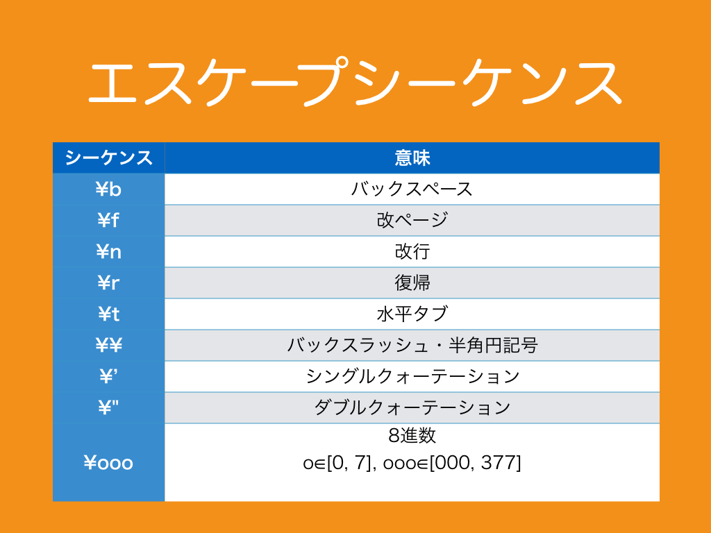
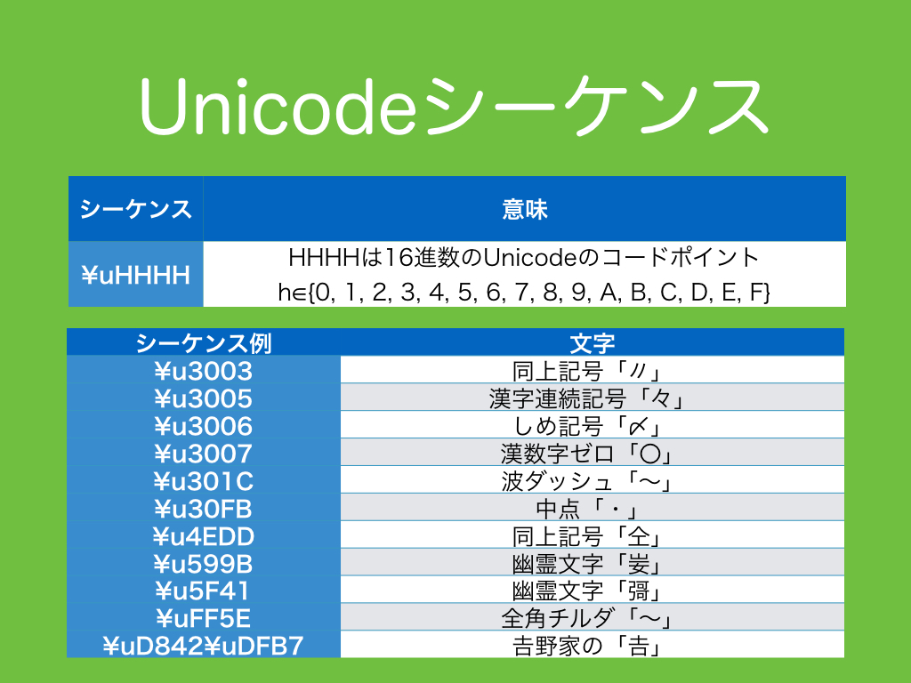
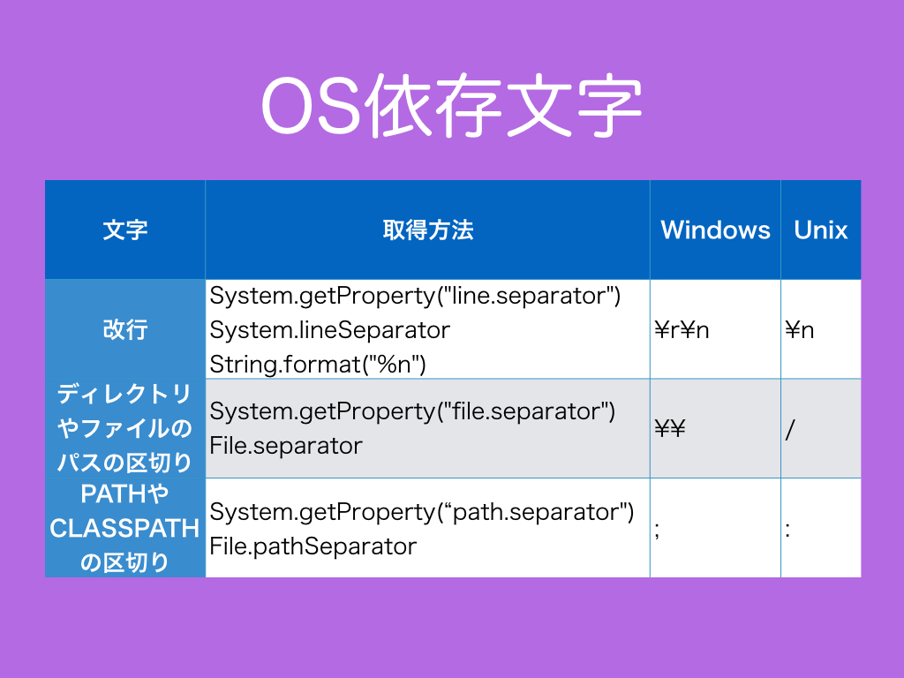

# 3.　特殊な文字
Scalaで特殊な扱いをする文字について、エスケープシーケンスとUnicodeシーケンスとOS依存文字を説明します。
<h3>3.1　エスケープシーケンス</h3>

<br>
Scala/Javaで使用するエスケープシーケンスの一覧です。bは"Back space"、fは"form Feed"、nは"New line"、rは"carriage Return"、tは"horizontal Tab"（ASCIIなどにはvertical tabも存在します。<a href="https://ja.wikipedia.org/wiki/ASCII#ASCII.E5.88.B6.E5.BE.A1.E6.96.87.E5.AD.97" target="_blank">ASCII制御文字</a>）の略字です。タイプライターの時代から"back space"や"carriage return"、"new line (タイプライターではline feed)"、"horizontal tab (タイプライターではtab)"が存在します。"carriage return"はタイプライターからの名残で、コンピュータでは既に役目を終えているが、Microsoft社がWindowsに残しました。  
表にあるように８進数のエスケープシーケンスは存在しますが、似た物として８進数のInt型のリテラルはScala 2.10からdeprecated (<a href="http://docs.oracle.com/javase/jp/8/docs/api/java/lang/Deprecated.html" target="_blank">Java 8のDeprecated</a>と<a href="http://www.scala-lang.org/api/current/index.html#scala.deprecated" target="_blank">Scalaのdeprecated</a>でdeprecatedの意味は同じですが、Java 8の方が比較的細かくdeprecatedの説明が書かれています)になりました。Ref. 
<a href="https://github.com/scala/scala-dist/pull/20" target="_blank">Removed Octal literals</a>
```scala
  @Test
  def testEscapeSequence(): Unit = {
    //バックスペース
    val backSpace = '\b'
    //改ページ
    val formFeed = '\f'
    //改行
    val newLine = '\n'
    //復帰
    val carriageReturn = '\r'
    //水平タブ
    val horizontalTab = '\t'
    //バックスラッシュ
    val backSlash = '\\'
    //シングルクォーテーション
    val singleQuotation = '\''
    //ダブルクォーテーション
    val doubleQuotation = '\"'
    //８進数
    val octalNumberOfZero = '\000'
    val octalNumberOfTwoHundredFiftyFive = '\377'

    assert(octalNumberOfZero == 0)
    assert(octalNumberOfTwoHundredFiftyFive == 255)
  }
```
***
<h3>3.2　Unicodeシーケンス</h3>

<br>
Unicodeシーケンスは文字に関するリテラル内にBMP領域の16bitのコードポイントによって文字を記述する方法です。例では、漢字なのか記号なのか作成するアプリケーションの目的によって変わりそうな文字をUnicodeシーケンスで表現してみました。最後の𠮷野家の<a href="https://ja.wiktionary.org/wiki/%F0%A0%AE%B7" target="_blank">「𠮷」</a>はBMP領域にはなく追加領域の文字なのでサロゲートペア、つまり２つもUnicodeシーケンスで表現します。このような追加領域の文字は文字列リテラルや生文字リテラルでは表現できるが、文字リテラルでは表現できません。
```scala
  @Test
  def testUnicodeSequence(): Unit = {
    //同上記号「〃」
    val dojo1 = '\u3003'

    assert(dojo1 == '〃')

    //漢字連続記号「々」
    val kanjiRenzoku = '\u3005'

    assert(kanjiRenzoku == '々')

    //しめ記号「〆」
    val shime = '\u3006'

    assert(shime == '〆')

    //漢数字ゼロ「〇」
    val zero = '\u3007'

    assert(zero == '〇')

    //波ダッシュ「〜」
    val waveDash = '\u301C'

    assert(waveDash == '〜')

    //中点「・」
    val chuten = '\u30FB'

    assert(chuten == '・')

    //同上記号「仝」
    val dojo2 = '\u4EDD'

    assert(dojo2 == '仝')

    //幽霊文字「妛」
    val yurei1 = '\u599B'

    assert(yurei1 == '妛')

    //幽霊文字「彁」
    val yurei2 = '\u5F41'

    assert(yurei2 == '彁')

    //全角チルダ「～」
    val fullWidthTilde = '\uFF5E'

    assert(fullWidthTilde == '～')

    //𠮷野家の「𠮷」
    val yoshi = "\uD842\uDFB7"

    assert(yoshi == "𠮷")
  }
```
幽霊文字については<a href="#コラム幽霊文字">コラム：幽霊文字</a>、波ダッシュと全角チルダの問題については<a href="#コラム波ダッシュと全角チルダの問題">コラム：波ダッシュと全角チルダの問題</a>を参照ください。
***
<h3>3.3　OS依存文字</h3>

<br>
OSに依存する改行文字、パスの区切り文字、クラスパスの区切り文字は次のように取得できます。ただし、Windowsはキャリッジリターン"\r"なしでも改行を行うことや、パスの区切り文字がUnix環境の"\\"と"/"の両方が混在しても許容されるため、それらについてはUnix側に合わせれば良いという考え方もあります。
```scala
  @Test
  def testOSDependentCharacter(): Unit = {
    //改行
    //Windows: \r\n
    //Unix:      \n
    val newLine1 = System.getProperty("line.separator")
    val newLine2 = System.lineSeparator()
    val newLine3 = String.format("%n")

    assert(newLine1 == newLine2)
    assert(newLine2 == newLine3)
    assert(newLine1 == newLine3)

    //ディレクトリやファイルのパスの区切り
    //Windows: \\
    //Unix:     /
    val fileSeparator1 = System.getProperty("file.separator")
    val fileSeparator2 = File.separator

    assert(fileSeparator1 == fileSeparator2)

    //PATHやCLASSPATHの区切り
    //Windows: ;
    //Unix:    :
    val pathSeparator1 = System.getProperty("path.separator")
    val pathSeparator2 = File.pathSeparator

    assert(pathSeparator1 == pathSeparator2)
  }
```
***
<h3>コラム：<a href="https://ja.wikipedia.org/wiki/%E5%B9%BD%E9%9C%8A%E6%96%87%E5%AD%97" target="_blank">幽霊文字</a></h3>
文字コードには含まれているが、一体どこで使われているのかわからない、この世には存在しない文字のことを幽霊文字と言います。代表的なものに<a href="https://ja.wiktionary.org/wiki/%E5%A6%9B" target="_blank">「妛」</a>や<a href="https://ja.wiktionary.org/wiki/%E5%BD%81" target="_blank">「彁」</a>があります。紙に書かれた大量の文字の電子化がいかに大変な作業であったかを考えれば、このようにいくつか<a href="https://ja.wikipedia.org/wiki/%E3%83%92%E3%83%A5%E3%83%BC%E3%83%9E%E3%83%B3%E3%82%A8%E3%83%A9%E3%83%BC" target="_blank">ヒューマンエラー</a>が起こるのは仕方ないことかもしれません。
***
<h3>コラム：波ダッシュと全角チルダの問題</h3>
波ダッシュと全角チルダの問題については、次のページを読んでください。  
<a href="https://ja.wikipedia.org/wiki/Unicode#.E6.B3.A2.E3.83.80.E3.83.83.E3.82.B7.E3.83.A5.E3.83.BB.E5.85.A8.E8.A7.92.E3.83.81.E3.83.AB.E3.83.80.E5.95.8F.E9.A1.8C" target="_blank">波ダッシュ・全角チルダ問題</a>
