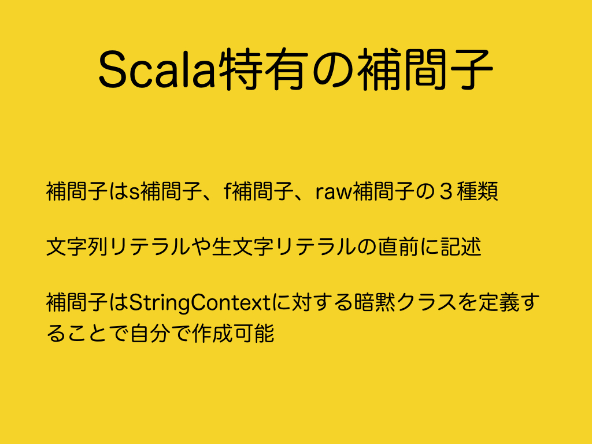
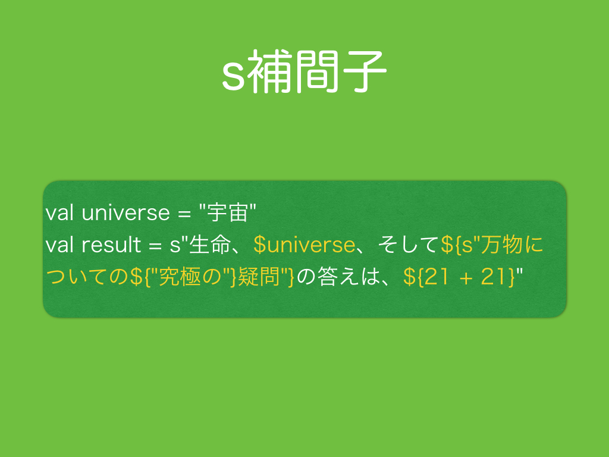
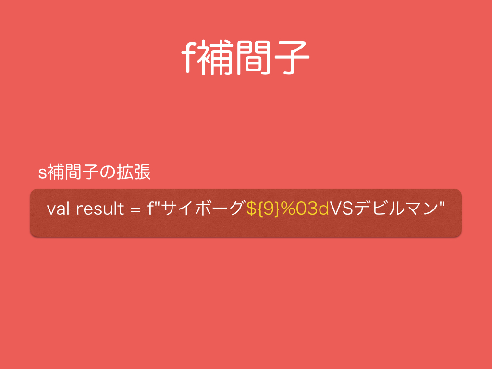
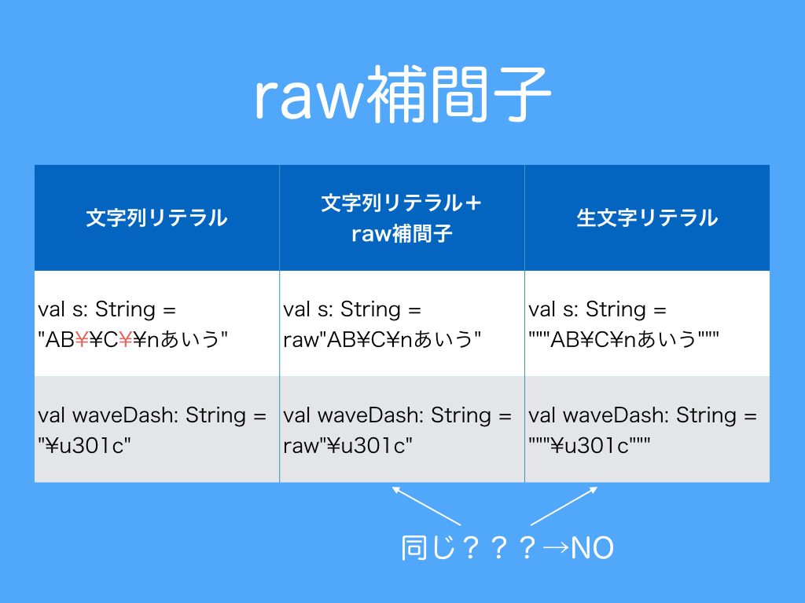
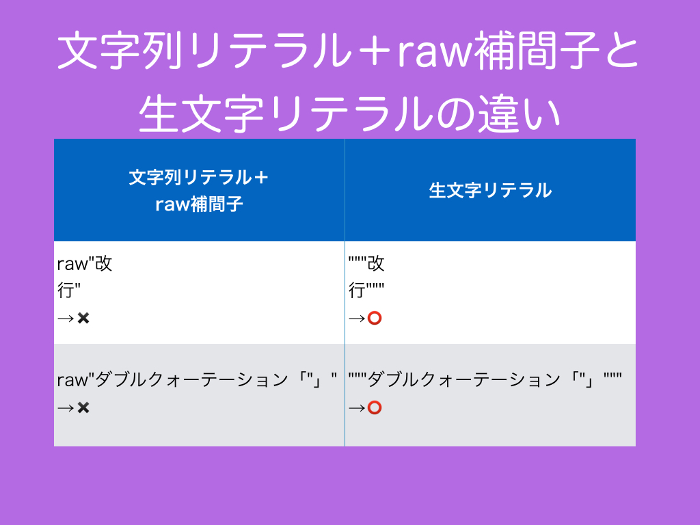
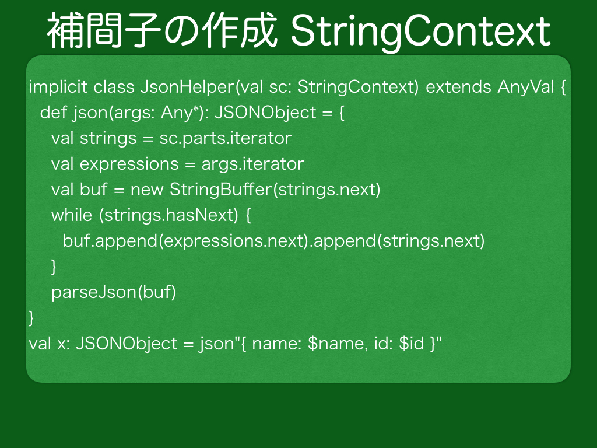
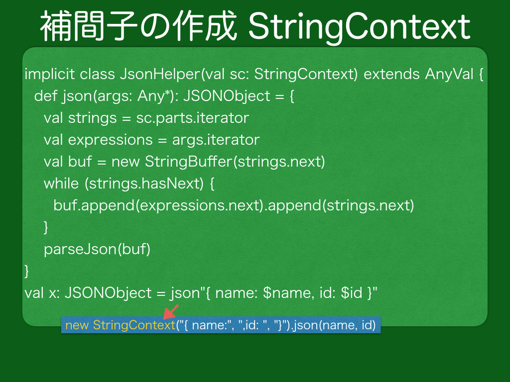
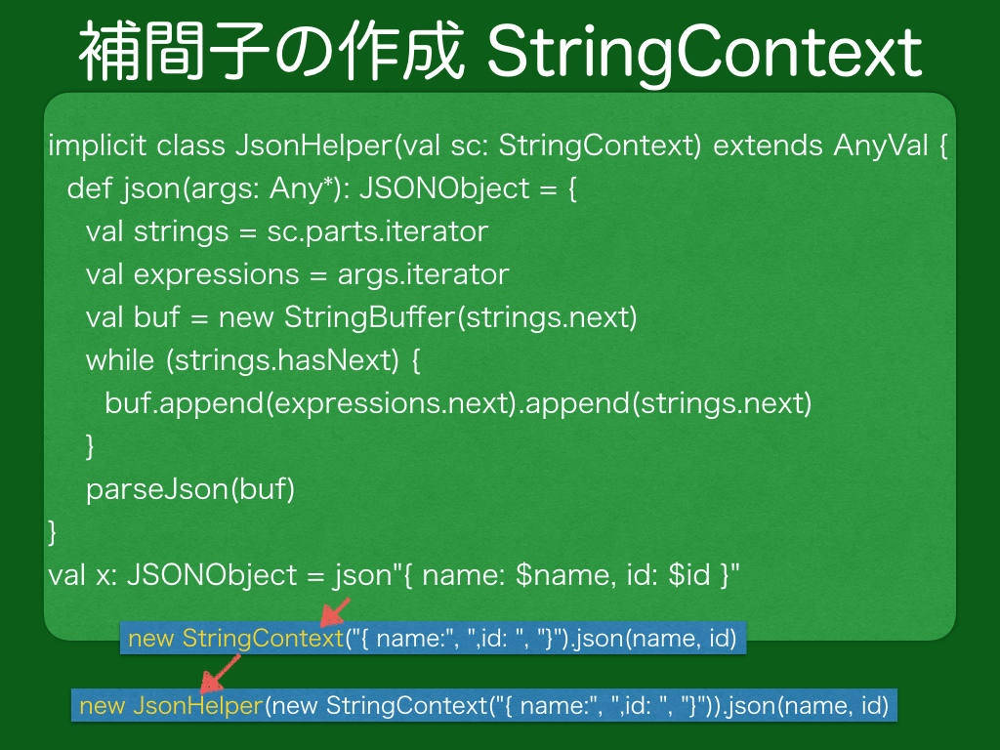
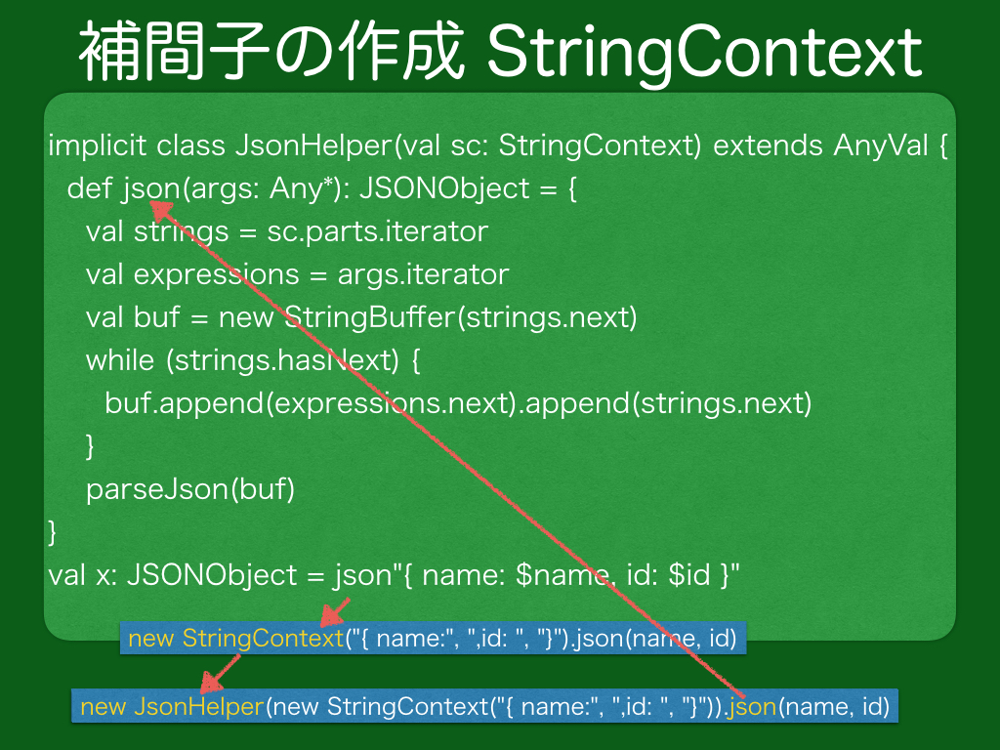

# 2.　補間子

<br>
文字列リテラルや生文字リテラルに、それらリテラルような直感的な書き方で処理を加える方法として補間子（interpolation）があります。標準で用意されているのは、s補間子、f補間子、raw補間子の３種類です。それぞれ、s, f, rawを文字列リテラルや生文字リテラルの直前に書くことで補間子として機能します。補間子は<a href="http://www.scala-lang.org/api/current/index.html#scala.StringContext" target="_blank">StringContext</a>クラスを使用することで自作することが可能です。
***
<h3>2.1　s補間子</h3>

<br>
まずs補間子ですが、<a href="https://ja.wikipedia.org/wiki/Bash" target="_blank">Bash</a>や<a href="https://ja.wikipedia.org/wiki/Perl" target="_blank">Perl</a>、<a href="https://ja.wikipedia.org/wiki/PHP:_Hypertext_Preprocessor" target="_blank">PHP</a>の文字列のように変数を$記号を使用することでスライドのように直接値を埋め込むことができます。

```scala
  @Test
  def testSInterpolation(): Unit = {
    val universe = "宇宙"
    val result = s"生命、$universe、そして${s"万物についての${"究極の"}疑問"}の答えは、${21 + 21}"

    assert(result == "生命、宇宙、そして万物についての究極の疑問の答えは、42")
  }
```
***
<h3>2.2　f補間子</h3>

<br>
次にf補間子ですが、s補間子で埋め込む値の埋め込み方をf補間子ではC言語のprintfのフォーマットのように指定することができます。スライドでは、`${9}`で１０進整数9を埋め込むことを指定し、直後の`%03d`で１０進整数（decimalのd）に対して、３桁で埋め込み、足りない桁には0を使用することを指定しています。そのため、`${9}`の「9」が結果では「009」に変化しています。

```scala
  @Test
  def testFInterpolation(): Unit = {
    val result = f"サイボーグ${9}%03dVSデビルマン"

    assert(result == "サイボーグ009VSデビルマン")
  }
```
***
<h3>2.3　raw補間子</h3>

<br>
raw補間子ですが、raw補間子は生文字リテラルと同じようにエスケープシーケンスをエスケープせずに表記通り表現したい際に使用します。raw補間子は生文字リテラルと同様にUnicodeシーケンスは\記号が必要です。では文字列リテラルにraw補間子を使用した場合と生文字リテラルとの間に違いはあるのでしょうか。

```scala
  @Test
  def testRawInterpolation(): Unit = {
    val sStringLiteral:    String = "AB\\C\\nあいう"
    val sRawInterpolation: String = raw"AB\C\nあいう"
    val sRawLiteral:       String = """AB\C\nあいう"""

    assert(sStringLiteral == sRawInterpolation)
    assert(sRawInterpolation == sRawLiteral)
    assert(sStringLiteral == sRawLiteral)

    val waveDashStringLiteral:   String = "\u301c"
    val waveDashRawIntepolation: String = raw"\u301c"
    val waveDashRawLiteral:      String = """\u301c"""

    assert(waveDashStringLiteral == waveDashRawIntepolation)
    assert(waveDashRawIntepolation == waveDashRawLiteral)
    assert(waveDashStringLiteral == waveDashRawLiteral)
  }
```
***
<h3>2.4　文字列リテラル＋raw補間子と生文字リテラルの違い</h3>

<br>
改行とダブルクォーテーション記号の扱いにおいて、文字列リテラルにraw補間子を使用した場合と生文字リテラルとの間に違いがあります。raw補間子で解釈する前は文字列リテラルなので、文字列リテラルの内部では生文字リテラルのように改行することはできません。文字列リテラルの内部にはダブルクォーテーション記号を書くこともできません。

```scala
  @Test
  def testDifferenceBetweenRawInterpolationAndRawStringLiteral(): Unit = {
    //val newLineRawInterpolation: String = raw"改
//行"
    val newLineRawStringLiteral: String = """改
行""".stripMargin

    //val doubleQuotationRawInterpolation: String = raw"ダブルクォーテーション「"」"
    val doubleQuotationRawStringLiteral: String = """ダブルクォーテーション「"」"""
  }
```
***
<h3>2.5　補間子の自作</h3>

<br>
s補間子、f補間子、raw補間子のような補間子を自作することができます。スライドでは、作成したjson補間子の挙動を説明します。  

<br>
まず、json補間子は暗黙的にStringContextクラスのインスタンスを作成します。
<br>

<br>
json補間子はStringContextの自作のラッパーであるJsonHelperクラスのインスタンスを暗黙的に作成します。
<br>

<br>
JsonHelperクラスのjsonメソッドが呼ばれます。
実際に作成したjson補間子は下記サンプルコードに載せましたので、そちらを参照してください。

```scala
  @Test
  def testStringContext(): Unit = {
    assert(Day2TestStringContext.test() == "{ name: 名前, id: ID }")
  }
```
```scala
object Day2TestStringContext {
  def test(): String = {
    val name = "名前"
    val id = "ID"
    val x: JSONObject = json"{ name: $name, id: $id }"
    x.toString
  }

  class JSONObject(jsonText: String) {
    override def toString: String = jsonText
  }

  implicit class JsonHelper(val sc: StringContext) extends AnyVal {
    def parseJson(charSequence: CharSequence): JSONObject = {
      new JSONObject(charSequence.toString)
    }

    def json(args: Any*): JSONObject = {
      val strings = sc.parts.iterator
      val expressions = args.iterator
      val buf = new StringBuffer(strings.next)
      while (strings.hasNext) {
        buf.append(expressions.next).
          append(strings.next)
      }
      parseJson(buf)
    }
  }
}
```
